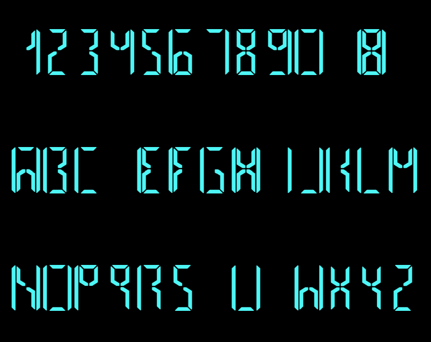

# IELetter

Font that imitates the Electroluminescent Display that ware made only for military use during the Soviet era in the 1980s.

>The segment pattern can generate nearly every Cyrillic and Roman character (except the letter T) using only eight segments. 
>([IEL\-0\-VI Multi\-segment Electroluminescent Display 101\-178](http://lampes-et-tubes.info/cd/cd113.php?l=e))

However, the pattern is unknown.

## Download

https://github.com/jz5/fonts-ieletter/tree/main/release

## Description and samples

See https://pronama.jp/ieletter/

## License

[SIL Open Font License](https://scripts.sil.org/cms/scripts/page.php?site_id=nrsi&id=ofl)

## Contribution

Please post an issue first.
